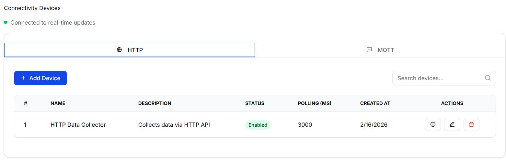
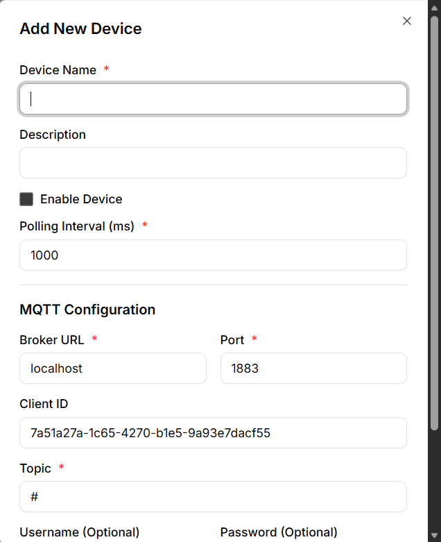
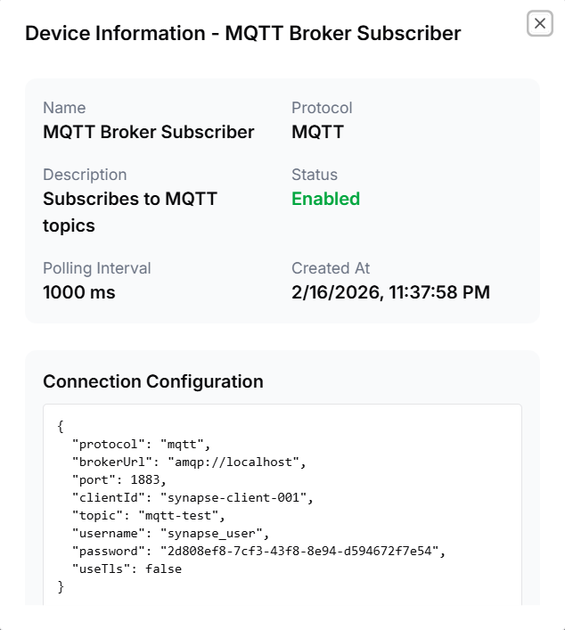
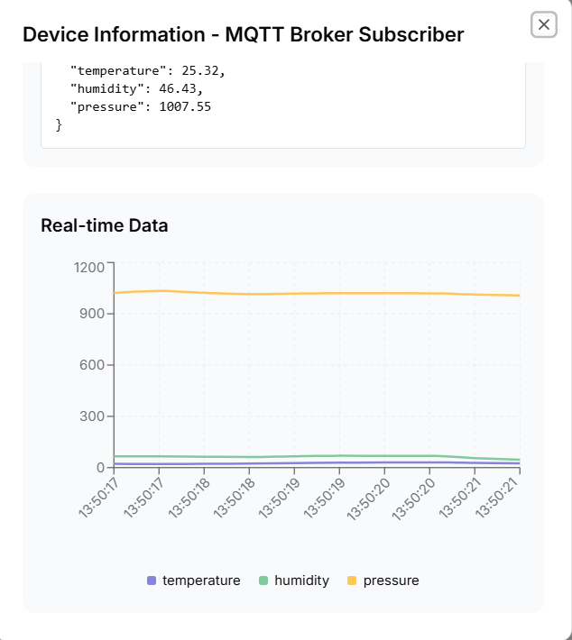

# Synapse IIoT Frontend

Platform IIoT (Industrial Internet of Things) berbasis React Router untuk mengelola konektivitas perangkat dan data secara real-time.

## 🚀 Teknologi

- React Router v7 dengan Server-side Rendering
- TypeScript untuk type safety
- TailwindCSS untuk styling
- SignalR untuk real-time communication
- Vite untuk build tool

## 📋 Daftar Menu & Fitur

### 1. Connectivity - Devices

Menu untuk mengelola perangkat IoT yang terhubung dengan sistem. Mendukung protokol HTTP dan MQTT.

**URL:** `/connectivity/devices`


_Screenshot halaman Connectivity Devices_

#### Fitur:

- **Tampilan Berbasis Tab**: Protokol HTTP dan MQTT ditampilkan dalam tab terpisah
- **Search & Filter**: Pencarian perangkat berdasarkan nama
- **Pagination**: Navigasi data dengan sistem paginasi (10 item per halaman)
- **Real-time Updates**: Integrasi SignalR untuk update status perangkat secara real-time
- **CRUD Operations**:
  - Create: Tambah perangkat baru
  - Read: Lihat daftar & detail perangkat
  - Update: Edit konfigurasi perangkat
  - Delete: Hapus perangkat dengan konfirmasi

#### Dialog yang Tersedia:

##### a. Device Form Dialog

Dialog untuk menambah atau mengedit perangkat.


_Screenshot Device Form Dialog_

**Fungsi:**

- Menambah perangkat baru
- Mengedit konfigurasi perangkat yang sudah ada
- Form input untuk nama, protokol, dan konfigurasi perangkat

**Cara Akses:**

- Klik tombol "Add Device" untuk membuat perangkat baru
- Klik tombol "Edit" pada card perangkat untuk mengedit

##### b. Device Info Dialog

Dialog untuk melihat informasi detail perangkat.


_Screenshot Device Info Dialog_

**Fungsi:**

- Menampilkan informasi lengkap perangkat
- Melihat status koneksi real-time
- Detail konfigurasi perangkat

**Cara Akses:**

- Klik tombol "Info" pada card perangkat

---

##### c. Chart Realtime Data

Dialog untuk melihat chart data secara real-time.


_Screenshot Device Realtime_

**Fungsi:**

- Menampilkan chart real-time

**Cara Akses:**

- Klik tombol "Info" pada card perangkat

---

### 2. Data Engine - Dynamic Tables

Menu untuk membuat dan mengelola tabel dinamis untuk menyimpan data IoT.

**URL:** `/data-engine/dynamic-tables`


_Screenshot halaman Dynamic Tables_

#### Fitur:

- **Table Management**: Kelola tabel-tabel database secara dinamis
- **Search**: Pencarian tabel berdasarkan nama
- **Pagination**: Navigasi data dengan sistem paginasi (10 item per halaman)
- **CRUD Operations**:
  - Create: Buat tabel baru
  - Read: Lihat daftar tabel
  - Update: Edit konfigurasi tabel
  - Delete: Hapus tabel dengan konfirmasi
- **Field Management**: Kelola field/kolom pada setiap tabel

#### Dialog yang Tersedia:

##### a. Master Table Form Dialog

Dialog untuk menambah atau mengedit tabel.


_Screenshot Master Table Form Dialog_

**Fungsi:**

- Membuat tabel baru
- Mengedit nama dan konfigurasi tabel
- Form input untuk nama tabel dan deskripsi

**Cara Akses:**

- Klik tombol "Add Table" untuk membuat tabel baru
- Pilih "Edit" dari dropdown menu pada baris tabel

##### b. Master Table Fields Dialog

Dialog untuk mengelola field/kolom pada tabel.


_Screenshot Master Table Fields Dialog_

**Fungsi:**

- Menambah field/kolom baru ke tabel
- Mengedit field yang sudah ada
- Mengatur tipe data field (Text, Number, Boolean, Date, dll)
- Menghapus field dari tabel
- Mengatur field sebagai required/optional

**Cara Akses:**

- Pilih "Manage Fields" dari dropdown menu pada baris tabel

---

## 🛠️ Instalasi & Penggunaan

### Instalasi Dependencies

```bash
npm install
```

### Menjalankan Development Server

```bash
npm run dev
```

Aplikasi akan berjalan di `http://localhost:5173`

### Build untuk Production

```bash
npm run build
```

## 🐳 Docker Deployment

Build dan jalankan menggunakan Docker:

```bash
# Build image
docker build -t synapse-iiot-fe .

# Run container
docker run -p 3000:3000 synapse-iiot-fe
```

## 📁 Struktur Project

```
app/
├── components/        # Komponen UI reusable
│   ├── layouts/      # Layout komponen & dialogs
│   └── ui/           # UI components (Button, Card, dll)
├── contexts/         # React contexts (Auth, dll)
├── hooks/            # Custom hooks
├── lib/              # Utilities & helpers
├── routes/           # Halaman aplikasi
├── services/         # API services
└── types/            # TypeScript type definitions
```

## 🔐 Autentikasi

Aplikasi menggunakan sistem autentikasi dengan fitur:

- Login
- Register
- Protected Routes
- Auth Context untuk state management

## 📱 Fitur Real-time

- **SignalR Integration**: Update data real-time untuk status perangkat
- **Auto Refresh**: Data otomatis terupdate tanpa refresh halaman

## 🎨 UI Components

Aplikasi menggunakan custom UI components berbasis shadcn/ui:

- Button, Card, Input, Label
- Dialog, Sheet, Dropdown Menu
- Tabs, Pagination
- Breadcrumb, Sidebar
- Spinner, Skeleton (loading states)
- NoData component untuk empty states

---

Built for Industrial IoT Solutions
